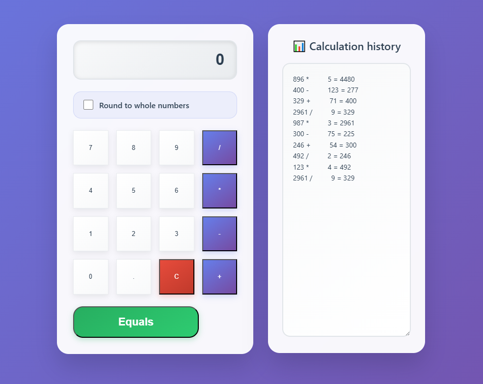
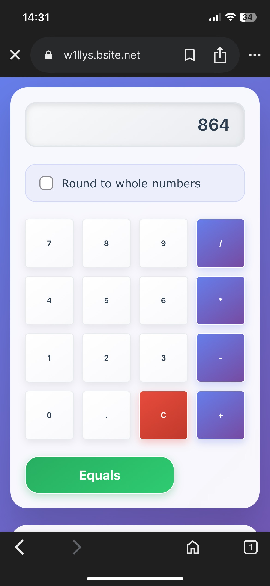

# Calculator_advanced

Advanced calculator is a mobile-first ASP.NET WebForms application with a clean, intuitive UI for basic arithmetic (+, -, *, /), optional whole-number rounding, and a scrollable history of your last 10 calculations. The application is also unit tested to ensure reliability and correctness. 

🚀 Available at: https://w1llys.bsite.net

---

## Features

- **Responsive Layout**  
  • **Desktop**: Inputs and operation buttons side-by-side with history.  
  • **Mobile**: Stacked layout for easy one-handed use.

- **Basic Arithmetic**  
  Addition, subtraction, multiplication, division with divide-by-zero handling.

- **Rounding Toggle**  
  Check “Round to whole numbers” to automatically round your result.

- **Calculation History**  
  Stores the 10 last entries in a scrollable card.

---

## Interface Preview

**Desktop View**  

  

**Mobile View**  

  

---

## Technologies Used

- **Framework**: .NET Framework 4.7.2 (ASP.NET WebForms)  
- **Language**: C#  
- **Unit Testing**: MSTest, Moq  
- **Database**: SQL Server
- **Data Access**: Dapper
- **IDE**: Visual Studio 2022  

---

## Usage

1. Enter your numbers using the on-screen keypad.  
2. (Optional) Enable **Round to whole numbers**.  
3. Tap one of the operation buttons (`+`, `-`, `*`, `/`).  
4. Hit the **Equals** button to compute.  
5. View your result in the display and check the history below.  

---

## Error Handling

- **Divide by Zero**  
  Shows a clear “Cannot divide by zero” message without crashing.

- **Invalid Input**  
  Rejects non-numeric entries and prompts you to correct them.

---

## Future Improvements

* **Larger Fonts & Accessibility**
  Increase font sizes on buttons and display for better readability. 

* **Web API Backend**
  Expose calculation endpoints via a RESTful Web API to learn more about API. 

* **Theming & Dark Mode**
  Offer light/dark themes and let users switch at runtime.
  
* **Mobile Application**
  Build native iOS and Android calculator apps with a customizable themes and synchronized calculation history.

  
